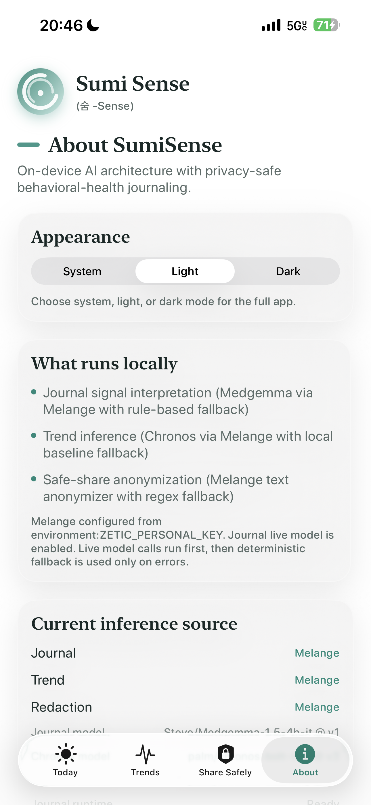
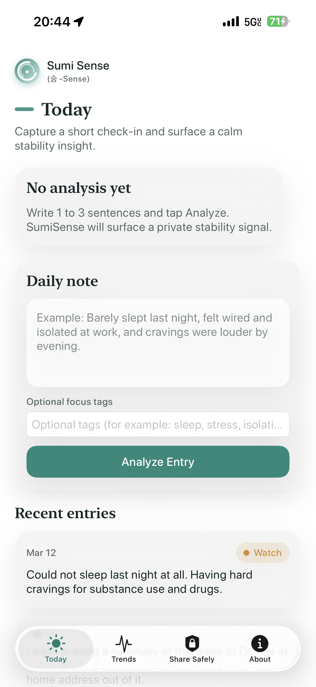
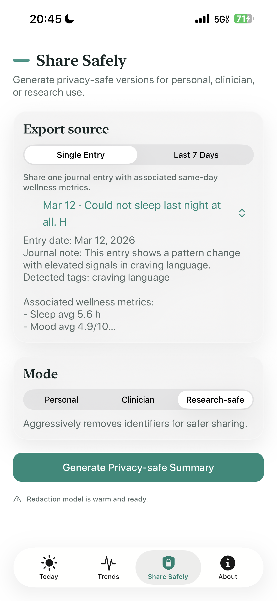
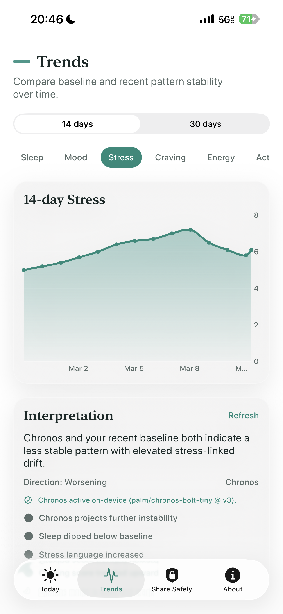

# SumiSense

SumiSense is a privacy-first iOS MVP for behavioral-health journaling and safe sharing.
It helps a user capture a short daily note, understand stability shifts over time, and export a privacy-safe summary.

  
  
  
  

   <a href="https://docs.google.com/presentation/d/1VXZsFp3cOM6Ev29095GKPuF5zglLrwmnaVY98KyeKyQ/edit?usp=sharing">View Presentation</a> &nbsp;&nbsp;|&nbsp;&nbsp;  <a href="https://www.youtube.com/watch?v=tlESocZrhHk">Watch Demo</a> 

## Why This App Exists
People often avoid journaling tools when they feel too cloud-heavy or too clinical.
SumiSense is designed for a user persona that wants:
- calm daily check-ins
- trend awareness without alarmism
- a safer way to share progress with a clinician/support contact
- on-device-first intelligence where possible

## Models Used

| Model Used | Purpose | Service |
|------------|---------|---------------|
| Qwen3-4B | Text behavioral analysis | Today Journal |
| text-anonymizer-v1 | PHI Export | Send Safely |
| chronos-bolt-tiny | Time series analysis | Behavioral Trends |

## Current Feature Set

### 1) Today (Daily Log + Insight)
- Write a short note (1 to 3 sentences)
- Analyze note into `Stable` / `Watch` / `Elevated`
- Show signal tags (sleep disruption, stress, craving, isolation, fatigue)
- Save new note into recent journal history

**Zetic usage**
- `ZeticMLangeLLMModel` (Journal LLM path) via `MelangeMedgemmaJournalService`

**Why it is used**
- Fast local language interpretation on-device without building cloud infra

**Why useful for persona**
- Gives immediate, private pattern feedback after a short daily check-in

### 2) Trends (14/30 Day Pattern Shift)
- View 14-day and 30-day windows
- Metric switching (sleep, mood, stress, craving, energy, steps)
- Baseline-vs-recent interpretation in plain language
- Chart-driven trend storytelling for demo flow

**Zetic usage**
- `ZeticMLangeModel` with Chronos model via `MelangeChronosTrendService`

**Why it is used**
- Time-series model path for projected drift/stability signal

**Why useful for persona**
- Helps user notice “less stable than baseline” patterns before things escalate

### 3) Share Safely (Transform + Export)
- Modes: `Personal`, `Clinician`, `Research-safe`
- Before/After comparison view
- Hybrid redaction pipeline with quality guardrails
- Copy and export (native iOS share sheet)
- Optional 7-day export source with local metrics context

**Zetic usage**
- `ZeticMLangeModel` text anonymizer via `MelangeAnonymizerRedactionService`
- Bundled tokenizer + labels assets (`Resources/MelangeAssets`)

**Why it is used**
- On-device anonymization primitives for PHI-like text handling

**Why useful for persona**
- Enables safer sharing without manually editing personal details each time

### 4) About (Runtime Control + Transparency)
- Runtime model source view (Melange vs fallback)
- Journal live model toggle (experimental)
- `Refresh Status` action to prewarm/check models for live demo
- Light/Dark/System appearance selector
- Non-diagnostic product boundary

**Zetic usage**
- Warmup + readiness checks call Melange-backed services directly

**Why useful for persona/demo**
- Transparency builds trust; operator can stabilize demo quickly

### 5) Onboarding + Launch Experience
- First-launch onboarding modal (privacy-first, on-device, non-diagnostic boundary)
- Branded launch card and polished tab flow

### 6) Data + Persistence
- Seeded demo story with realistic entries and metrics arc
- Local persistence of journal entries and metric points

## Why Zetic Is Essential Here
Zetic MLange is the enabler for this MVP because it provides:
- a unified iOS SDK surface for both LLM and non-LLM models
- on-device model delivery/loading and runtime execution modes
- CoreML target paths used by trend/redaction services
- a practical way to ship real inference scaffolding quickly in a hackathon window

Without Zetic, this app would either:
- ship as pure heuristics (lower demo credibility), or
- require cloud inference (breaks the privacy-first story and adds backend scope).

## Architecture
- SwiftUI + MVVM state flow (`AppStateViewModel` + tab-specific VMs)
- Protocol boundaries:
  - `JournalInferenceService`
  - `TrendInferenceService`
  - `RedactionService`
- Coordinator orchestration:
  - `WellnessInsightCoordinator`
- Live-first with deterministic fallbacks:
  - Journal: Melange LLM -> `RuleBasedJournalService`
  - Trend: Chronos -> `HeuristicTrendService`
  - Redaction: Anonymizer (+ post-filter) -> `RegexRedactionService`

## Repository Layout
- `SumiSense/` iOS app source
- `SumiSense/App/` app entry, tabs, launch shell
- `SumiSense/Views/` Today, Trends, Share Safely, About, onboarding
- `SumiSense/ViewModels/` app and tab view models
- `SumiSense/Models/` domain models/enums
- `SumiSense/Services/` protocols, coordinator, fallbacks, storage
- `SumiSense/Inference/` Melange adapters/config
- `SumiSense/DesignSystem/` colors, typography, spacing, motion
- `SumiSense/Components/` reusable UI components
- `SumiSense/Resources/SeedData/` seeded demo JSON
- `SumiSense/Resources/MelangeAssets/` tokenizer and labels assets
- `DemoAssets/Screenshots/` demo screenshot placeholder folder
- `LogicCore/` lightweight Swift package tests for core logic

## Setup
1. Open `SumiSense.xcodeproj` in Xcode.
2. Select scheme `SumiSense`.
3. Configure environment variables in:
   - `Product` -> `Scheme` -> `Edit Scheme...` -> `Run` -> `Arguments` -> `Environment Variables`
4. Build and run on device (recommended for live Melange).

**NOTE:** When running on Xcode, be sure to wait for all models to load in the app. There are logs and visual indicators for the same in both the phone and the IDE.

## Environment Variables

Required for live Melange:
- `ZETIC_PERSONAL_KEY` (preferred)

Optional aliases:
- `ZETIC_ACCESS_TOKEN`

Model config:
- `ZETIC_CHRONOS_MODEL_ID` (default `Team_ZETIC/Chronos-balt-tiny`)
- `ZETIC_CHRONOS_MODEL_VERSION` (default `5`)
- `ZETIC_REDACTION_MODEL_ID` (default `Steve/text-anonymizer-v1`)
- `ZETIC_REDACTION_MODEL_VERSION` (default `1`)
- `ZETIC_JOURNAL_MODEL_ID` (default `Qwen/Qwen3-4B`)
- `ZETIC_JOURNAL_MODEL_VERSION` (optional)
- `ZETIC_JOURNAL_MODEL_MODE` (`regular`, `speed`, `accuracy`)

Behavior toggles:
- `ZETIC_ENABLE_JOURNAL_MELANGE` (`1` to enable live journal model)
- `ZETIC_ENABLE_MEDGEMMA_JOURNAL` (`1` to allow Medgemma candidate)
- `ZETIC_PREWARM_MODELS` (`1` default)
- `ZETIC_PREWARM_JOURNAL` (`1` default)
- `ZETIC_PREFER_COREML_TARGETS` (`1` default)
- `ZETIC_ENABLE_JOURNAL_RAM_GUARD` (`1` to enforce RAM gating)

Timeout:
- Journal service timeout is currently 300s in code for cold/warm LLM runs.

## Simulator / Device Note
In many setups, the published `ZeticMLangeiOS` artifact does not include simulator slices.
If that happens:
- simulator uses fallback inference paths
- physical iPhone is required for full live Melange demo

## Testing
- Device build:
  - `xcodebuild -scheme SumiSense -project SumiSense.xcodeproj -destination 'generic/platform=iOS' build`
- Core logic tests:
  - `cd LogicCore && swift test`

## Non-Diagnostic Disclaimer
SumiSense is a pattern-awareness and safe-sharing tool.
It does not diagnose, treat, or replace clinical care.
